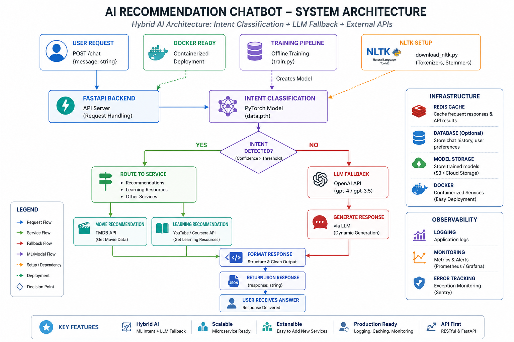

# 🚀 Movie Recommendation Chatbot
Dataset: https://www.kaggle.com/datasets/asaniczka/tmdb-movies-dataset-2023-930k-movies/data
        # Command1
            python -m venv .venv
        # Command2
        README.md
            (Set-ExecutionPolicy -Scope Process -ExecutionPolicy RemoteSigned) ; (& E:\GIT\movie-agent\.venv\Scripts\Activate.ps1)
        # Command3
            python -m pip install -r requirements.txt

    python download_nltk.py
    python train.py
    python app/main.py
    Postman -
    Endpoint: http://127.0.0.1:8000/chat
    Try with below payloads
    Payload:
        {
            "message":"Hi"
        }
    -------------------
        Response:
        {
            "response": "Hello! Ask me for movies or learning."
        }
____________________________________
    Payload: 
    {
    "message":"adventure movie"
    }
    -----------------------------
    Response
    {
        "response": "Try: Inception, Avengers, Interstellar"
    }

## Features
- FastAPI backend
- Intent classification (PyTorch)
- LLM fallback (OpenAI)
- Movie recommendations (TMDB API)
- Modular architecture
- Ready for Docker deployment

## Run

```bash
pip install -r requirements.txt
python train.py
uvicorn app.main:app --reload
```

## API

POST /chat

```json
{"message": "Suggest a comedy movie"}
```
## 🏗️ Architecture Overview

This project follows a **Hybrid AI Architecture** combining:
- Intent Classification (ML)
- LLM Fallback
- External APIs (Recommendations)

<p align="center">
  
</p>
