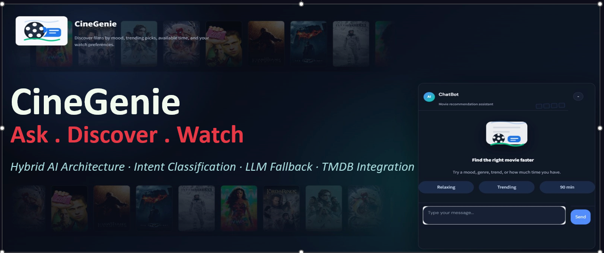
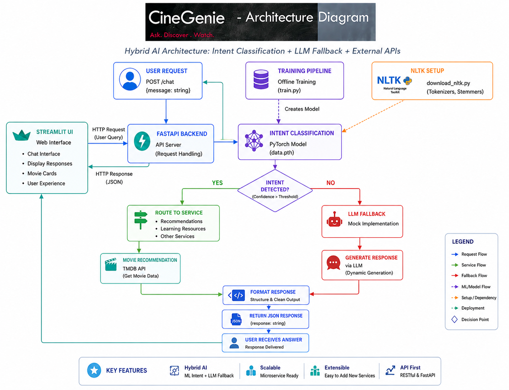

# 🚀 Movie Recommendation Chatbot

Source of Dataset : https://www.kaggle.com/datasets/asaniczka/tmdb-movies-dataset-2023-930k-movies/data
### Project Setup Steps
```bash
        # Command1
            python -m venv .venv
        # Command2
        README.md
            (Set-ExecutionPolicy -Scope Process -ExecutionPolicy RemoteSigned) ; (& ..\.venv\Scripts\Activate.ps1)
        # Command3
            python -m pip install -r requirements.txt
         # Command4 - to setup nltk dependencies
             download_nltk.py
```

# Step 1. Model Training
We can train the model any of the below  approaches.
## Approach 1 - Uses BERT model as base model
        python train_bert.py
## Approach 2 - Uses Bag Of Words/ NLTK (Alternate Approach)
        python train.py

# Step 2. Host the saved model with FAST API
      python app/main.py
Endpoint: http://127.0.0.1:8000/chat

POST Body Payload:-
```json
{
    "message":"can you please suggest romantic movie"
}
```
Response:-
```json
{
    "response": "I recommend these movies:",
    "movies": [
        {
            "title": "Bad Girls Behind Bars",
            "rating": 8.4,
            "runtime": "81 min",
            "release_year": "2016",
            "genres": "Drama, Romance",
            "overview": "Wise-cracking news reporter Georgina goes undercover in a women's prison to get the story of a lifetime. But she discovers she's stranded behind bars after her outside contact suddenly dies, now, the ",
            "poster_path": "/y1uRkUce2k3MP0xh2t793DDKiiF.jpg",
            "poster_url": "https://image.tmdb.org/t/p/w342/y1uRkUce2k3MP0xh2t793DDKiiF.jpg"
        },
        {
            "title": "Beauty Salon: Special Service 2",
            "rating": 8.375,
            "runtime": "90 min",
            "release_year": "2018",
            "genres": "Romance",
            "overview": "There is a special hair salon to satisfy from head to toe! Hyejin, who worked at a hairdresser who is famous as a decadent place. At first, I was reluctant to be served by my body, but from the moment",
            "poster_path": "/5qFTCvx1h1CsHqbAuqo68J8GSub.jpg",
            "poster_url": "https://image.tmdb.org/t/p/w342/5qFTCvx1h1CsHqbAuqo68J8GSub.jpg"
        }
    ]
}
```
# Step 2. Host the User Interface - Chatbot()
```bash
streamlit run chatbot_ui.py
```
<p align="center">
  
</p>


----------------------------------------------

## Features
- FastAPI backend
- Intent classification (PyTorch/BERT)
- LLM fallback 
- Movie recommendations (TMDB Dataset)
- Modular architecture

## 🏗️ Architecture Overview

This project follows a **Hybrid AI Architecture** combining:
- Intent Classification (ML)
- LLM Fallback
- Self hosted APIs (Recommendations)
<p align="center">
  
</p>
<p align="center">
  
</p>

## Contributors

- [Moni](https://github.com/emonhaz)
- [Pramendra Singh](https://github.com/your-github-username)
- [Sajith](https://github.com/sajithkn-alt)
- [Shashank](https://github.com/shashank160790)


----------------------------------------------------------------------------------------------------------------------

# Workflow Description

----------------------------------------------------------------------------------------------------------------------


## 🎬 Approach: 1 
### **1. Training Phase** (`train_bert.py`)

```
Intent Data → Data Preparation → Model Training → Saved Model
```

**What happens:**
- **Load intents**: Reads `new_intents.json` containing intent categories (greeting, movie_action, movie_comedy, etc.) with user patterns and bot responses
- **Prepare data**: 
  - Extracts all patterns and assigns them to their intent tags
  - Creates mappings: `tag2id` (e.g., "movie_action" → 0) and `id2tag` (reverse mapping)
  - Splits data: 80% training, 20% validation
- **Tokenize**: Uses DistilBERT tokenizer to convert text patterns into token IDs
- **Train model**: 
  - DistilBertForSequenceClassification trained for 20 epochs
  - Learns to classify user input patterns into intent categories
  - Uses learning rate 2e-5, batch size 4
  - Saves best model based on validation loss
- **Save artifacts**: 
  - `intent_model/` directory with model weights and tokenizer
  - `intent_model/meta.pkl` with tag mappings and config

---

### **2. Inference/Prediction Phase** (`modern_bert_predict.py`)

```
User Input → Tokenization → Model Prediction → Intent Classification → Response
```

**What happens:**
- **Load model**: Loads pre-trained DistilBERT model and tokenizer from `intent_model/`
- **Predict intent**: 
  - Encodes user input with tokenizer
  - Runs through model to get logits
  - Converts to probabilities using softmax
  - Returns top predicted intent + confidence score
- **Threshold check**: If confidence < 0.65, returns "fallback" (I don't understand)
- **Output**: Intent name + confidence percentage

---

### **3. Chatbot UI & API Layer** (`chatbot_ui.py`)

```
User Message → Streamlit Frontend → FastAPI Backend → Intent Prediction → Response Selection → Movie Recommendations
```

**What happens:**

**Frontend (Streamlit):**
1. User types message in chat interface
2. Sends via POST request to FastAPI backend (`http://localhost:8000/chat`)
3. Displays bot response with formatted message bubbles
4. Renders movie cards with posters, ratings, year, runtime

**Backend (FastAPI - not shown but referenced):**
1. Receives user message
2. Uses `modern_bert_predict.py` to predict intent
3. Looks up response in intents JSON based on predicted intent tag
4. For movie recommendations, queries TMDB API for actual movie data
5. Returns formatted response with movie details (title, poster, rating, etc.)

---

### **4. Intent Categories & Data Flow**

Your `intents.json` has these main categories:

| Intent | Purpose | Example Response |
|--------|---------|------------------|
| **greeting** | Hello interactions | "Hello! I can recommend movies..." |
| **movie_action** | Action movies | "Try: John Wick, Mad Max..." |
| **movie_comedy** | Funny movies | "Try: The Hangover, Superbad..." |
| **movie_horror** | Scary movies | "Try: The Conjuring, IT..." |
| **movie_mood_happy** | Cheer-up content | "Try: Forrest Gump..." |
| **movie_trending** | Popular now | "Popular picks: Oppenheimer, Dune..." |
| **fallback** | Unrecognized input | "Sorry, I didn't get that..." |

---

### **5. Complete User Journey Example**

```
1. User: "I want something funny to watch"
   ↓
2. Tokenizer: Converts to token IDs
   ↓
3. Model: Predicts intent "movie_comedy" (confidence 0.92)
   ↓
4. Response lookup: Gets responses for "movie_comedy" tag
   ↓
5. Backend: Selects response + queries TMDB for comedy movies
   ↓
6. Frontend: Displays "Try: The Hangover, Superbad, The Mask" 
            + movie cards with posters and ratings
```

---

### **Key Components Summary**

| Component | Role |
|-----------|------|
| **`train_bert.py`** | Trains DistilBERT on intent patterns |
| **`modern_bert_predict.py`** | Classifies user input into intents |
| **`chatbot_ui.py`** | Streamlit interface for user interaction |
| **`intents.json`** | Intent definitions and responses |
| **FastAPI backend** | Orchestrates prediction + movie data lookup |
| **TMDB API** | Provides movie metadata (posters, ratings, etc.) |


----------------------------------------------------------------------------------------------------------------------

----------------------------------------------------------------------------------------------------------------------

# 🎬 Approach: 2 

I'll analyze the end-to-end project flow starting from `train.py` by examining the key files and understanding how they connect.Now let me get the API routes file to complete the flow:Now I have all the necessary information to provide a comprehensive end-to-end project flow explanation.

---

## 🎬 End-to-End Project Flow: Movie Agent Chatbot

Here's the complete data flow starting from **`train.py`** through user interaction:

---

## **Phase 1: Training (`train.py`)**

```
Intent Data → Preprocessing → Neural Network Training → Saved Model
```

### **Step 1a: Load Intent Data**
```python
with open('app/data/intents.json') as f:
    intents = json.load(f)
```
- Loads intent definitions (16 categories: greeting, movie_action, movie_comedy, movie_horror, etc.)
- Each intent has patterns (user phrases) and responses

### **Step 1b: Extract & Preprocess**
```python
for intent in intents['intents']:
    tags.append(intent['tag'])
    for pattern in intent['patterns']:
        w = tokenize(pattern)        # Split into words
        all_words.extend(w)
        xy.append((w, intent['tag']))  # Training pair
```
- **Tokenize**: Convert patterns like "I want action movie" → ["i", "want", "action", "movie"]
- **Collect unique words** and tags

### **Step 1c: Stemming**
```python
all_words = sorted(set([stem(w) for w in all_words]))
```
- Reduces words to root form: "watching" → "watch", "movies" → "movi"
- Creates consistent vocabulary (e.g., ~100 unique words)

### **Step 1d: Bag-of-Words Vectorization**
```python
def bag_of_words(tokenized_sentence, words):
    sentence_words = [stem(w) for w in tokenized_sentence]
    bag = np.zeros(len(words), dtype=np.float32)
    for idx, w in enumerate(words):
        if w in sentence_words:
            bag[idx] = 1  # Mark presence of word
    return bag
```

**Example:**
```
Input: "I want action movie"
Tokens: ["i", "want", "action", "movie"]
Stemmed: ["i", "want", "action", "movi"]
Bag: [0, 1, 1, 0, 1, 0, ...]  (binary vector indicating word presence)
```

### **Step 1e: Neural Network Training**

```python
model = NeuralNet(len(X_train[0]), 8, len(tags))
#        Input size    Hidden layer   Output size (number of intents)
#        (~100 words)      (8 units)        (16 intents)
```

**Architecture (from `intent_model.py`):**
```
Input (100 dims) → Linear + ReLU → Hidden (8 dims) 
                 → Linear + ReLU → Output (16 dims - intent logits)
```

- **Training**: 200 epochs on all intent patterns
- **Loss**: CrossEntropyLoss (multi-class classification)
- **Optimizer**: Adam (learning rate 0.001)

### **Step 1f: Save Model Artifacts**
```python
torch.save({
    "strategy": "bow",
    "threshold": 0.7,
    "model_state": model.state_dict(),
    "input_size": 100,
    "hidden_size": 8,
    "output_size": 16,
    "all_words": all_words,
    "tags": tags
}, "data.pth")
```

✅ **Output:** `data.pth` (trained model weights + vocabulary)

---

## **Phase 2: Backend Setup (`app/main.py`)**

```python
app = FastAPI(title="AI Recommendation Chatbot")
app.add_middleware(CORSMiddleware, ...)  # Allow Streamlit frontend
app.include_router(router)  # Include POST /chat endpoint
```

**Starts FastAPI server on port 8000:**
- Loads trained model from `data.pth`
- Initializes recommendation engine with TMDB dataset
- Ready to accept POST requests

---

## **Phase 3: Intent Classification & Response (`app/services/intent_service.py`)**

```
User Message → Classify Intent → Route to Service → Return Response
```

### **Step 3a: Classification**
```python
def classify(msg):
    return classifier.predict(msg)
    # Returns: (intent_tag, confidence_score)
```

**Example:**
- Input: `"I want an action movie"`
- Output: `("movie_action", 0.92)`

### **Step 3b: Decision Logic**
```python
def get_intent_response(msg):
    tag, conf = classify(msg)
    
    # Check if movie query (keywords: "movie", "film", "trending", etc.)
    if is_movie_query(msg):
        return recommend("movie", msg)  # Query TMDB dataset
    
    # Low confidence → use LLM fallback
    if conf < CONF_THRESHOLD or tag == "fallback":
        return text_response(llm_fallback(msg))
    
    # Movie intent → fetch recommendations
    if tag.startswith("movie"):
        return recommend("movie", msg)
    
    # Non-movie intent → return template response
    for intent in intents["intents"]:
        if intent["tag"] == tag:
            return text_response(random.choice(intent["responses"]))
```

---

## **Phase 4: Movie Recommendation (`app/services/recommendation_service.py`)**

```
User Query → Extract Entities → Query Engine → Format Results → Return
```

### **Step 4a: Entity Extraction**
```python
entities = extract_entities(msg)
# Returns: {"genre": "action", "mood": "excited", "sort": "trending"}
```

### **Step 4b: Recommendation Logic**
```python
def get_movie_recommendations(msg: str) -> dict:
    engine = get_recommendation_engine()  # Load TMDB CSV
    
    # Runtime-based
    if "90 min" in msg:
        return engine.get_runtime_recommendations(90, n=5)
    
    # Mood-based
    elif "relaxing" in msg or "feel good" in msg:
        return engine.get_genre_recommendations("comedy", n=5)
    
    # Genre-based
    elif "action" in msg:
        return engine.get_genre_recommendations("action", n=5)
    
    # Trending
    else:
        return engine.get_trending_recommendations(5)
```

### **Step 4c: Format Response with Movie Cards**
```python
def format_movie_card(movie: dict) -> dict:
    return {
        "title": "John Wick",
        "rating": 7.4,
        "runtime": "101 min",
        "release_year": 2014,
        "genres": "Action, Crime, Thriller",
        "poster_url": "https://image.tmdb.org/t/p/w342/..."
    }
```

### **Step 4d: Return Response**
```python
{
    "response": "I recommend these movies:",
    "movies": [
        {"title": "John Wick", "rating": 7.4, ...},
        {"title": "Mad Max: Fury Road", "rating": 8.1, ...},
        ...
    ]
}
```

---

## **Phase 5: Frontend Display (`chatbot_ui.py` - Streamlit)**

```
FastAPI Response → Parse JSON → Render UI → Display to User
```

### **Step 5a: Send User Message**
```python
def handle_prompt(prompt: str) -> None:
    st.session_state.messages.append({"role": "user", "content": prompt})
    st.session_state.pending_prompt = prompt
```

### **Step 5b: Call Backend API**
```python
def get_bot_reply(prompt: str) -> tuple[str, bool, list[dict]]:
    response = requests.post(
        "http://localhost:8000/chat",
        json={"message": prompt},
        timeout=15
    )
    payload = response.json()
    return (
        payload.get("response"),
        payload.get("movies", [])
    )
```

### **Step 5c: Render Chat Bubbles**
```python
def render_bubble(role: str, text: str) -> None:
    # User message: right-aligned
    # Bot message: left-aligned with AI avatar
    st.markdown(f"""
        <div class="bubble-row {role}">
            <div class="avatar">{role.upper()}</div>
            <div class="bubble">{text}</div>
        </div>
    """, unsafe_allow_html=True)
```

### **Step 5d: Render Movie Cards**
```python
def render_movie_cards(movies: list[dict]) -> None:
    for movie in movies:
        st.markdown(f"""
            <article class="movie-card">
                
                <h3>{movie['title']}</h3>
                <p>{movie['rating']}/10 | {movie['runtime']} | {movie['release_year']}</p>
            </article>
        """, unsafe_allow_html=True)
```

---

## **Complete User Journey Example**

```
User Types: "I want a funny action movie to relax"
    ↓
[Streamlit Frontend]
    ↓
POST http://localhost:8000/chat
{
    "message": "I want a funny action movie to relax"
}
    ↓
[FastAPI Backend - app/main.py]
Routes to POST /chat endpoint
    ↓
[Intent Classification - intent_service.py]
1. Classify: ("movie_comedy", 0.88)
2. Check: is_movie_query() → TRUE
3. Route to: recommend("movie", msg)
    ↓
[Recommendation Engine - recommendation_service.py]
1. Extract entities: {"genre": "comedy", "mood": "relaxing"}
2. Query: engine.get_genre_recommendations("comedy", n=5)
3. Access: dataset/TMDB_movie_dataset_v11.csv
4. Filter & sort by rating/popularity
5. Format 5 movies with posters & metadata
    ↓
API Response:
{
    "response": "I recommend these movies:",
    "movies": [
        {
            "title": "The Hangover",
            "rating": 7.7,
            "runtime": "100 min",
            "release_year": 2009,
            "poster_url": "https://image.tmdb.org/t/p/w342/..."
        },
        ...4 more movies...
    ]
}
    ↓
[Streamlit Frontend - chatbot_ui.py]
1. Display bot message: "I recommend these movies:"
2. Display 5 movie cards with posters, ratings, runtime
3. User sees beautiful card layout
```

---

## **Architecture Diagram**

```
┌─────────────────────────────────────────────────────────────────┐
│                    TRAINING PHASE                                │
├─────────────────────────────────────────────────────────────────┤
│                                                                   │
│  intents.json  →  Tokenize  →  Stem  →  Bag-of-Words  →  NN    │
│  (16 intents)      words        words     Vectorize     Train    │
│                                                ↓                  │
│                                            data.pth              │
│                                          (saved model)           │
└─────────────────────────────────────────────────────────────────┘

┌─────────────────────────────────────────────────────────────────┐
│              INFERENCE PHASE (User Query)                        │
├─────────────────────────────────────────────────────────────────┤
│                                                                   │
│   ┌─────────────┐        ┌──────────────┐    ┌──────────────┐  │
│   │  Streamlit  │        │   FastAPI    │    │  Intent      │  │
│   │  Frontend   │───────→│   Backend    │───→│ Classifier   │  │
│   │ (chatbot_   │        │ (app/main.py)│    │ (NeuralNet)  │  │
│   │   ui.py)    │◄───────│              │◄───│              │  │
│   └─────────────┘        └──────────────┘    └──────────────┘  │
│        ↑ Display               Process             Predict      │
│        │ Movies                Routes              Intent       │
│        │ & Chat                                                  │
│        │                          ↓                              │
│        │                  ┌──────────────────────┐               │
│        │                  │  Recommendation      │               │
│        │                  │  Service             │               │
│        │                  │ (extract entities)   │               │
│        │                  └──────────────────────┘               │
│        │                          ↓                              │
│        └──────────────────┬───────┬───────┬─────────┐           │
│                           ↓       ↓       ↓         ↓           │
│                    Rec Engine (TMDB Dataset)  Format            │
│                    - Runtime filter            Movie Cards      │
│                    - Genre search              JSON             │
│                    - Trending sort                              │
│                                                                  │
└─────────────────────────────────────────────────────────────────┘
```

---

## **Key Files Summary**

| File | Purpose |
|------|---------|
| **`train.py`** | Trains intent classifier on intents.json patterns |
| **`data.pth`** | Saved model weights + vocabulary |
| **`app/main.py`** | FastAPI server initialization |
| **`app/api/routes.py`** | POST /chat endpoint definition |
| **`app/services/intent_service.py`** | Intent classification logic |
| **`app/services/recommendation_service.py`** | Movie recommendations from TMDB |
| **`app/utils/nlp_utils.py`** | Tokenize, stem, bag-of-words utilities |
| **`app/models/intent_model.py`** | 3-layer Neural Network architecture |
| **`app/data/intents.json`** | Intent definitions (16 categories) |
| **`dataset/TMDB_movie_dataset_v11.csv`** | Movie database (930k+ movies) |
| **`chatbot_ui.py`** | Streamlit frontend with chat UI |

---

## **Quick Start Commands**

```bash
# 1. Train the model
python train.py
# Output: data.pth

# 2. Start FastAPI backend
python app/main.py
# Listening on http://127.0.0.1:8000

# 3. Start Streamlit frontend (in new terminal)
streamlit run chatbot_ui.py
# Opens UI at http://localhost:8501
```

Now you have a complete movie recommendation chatbot leveraging trained intent classification + TMDB data! 🎬
